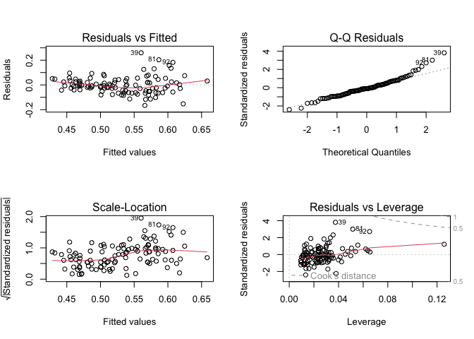
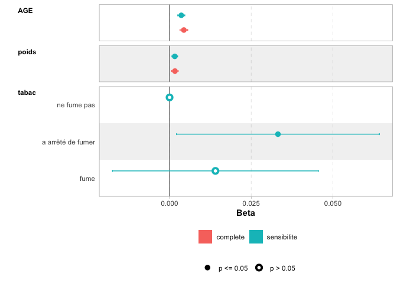

bete_eden_intima_rapport
================
2024-11-19

# Introduction

**L’athérosclérose** est une *maladie cardiovasculaire majeure*,
principale cause de mortalité dans les pays développés. Cette étude vise
à **identifier et quantifier les facteurs de risque** influençant
l’épaisseur de l’intima-média (IMT), un *marqueur reconnu de la
progression de la maladie*.

La variable à expliquer est la **mesure de l’épaisseur intima-média**
(en mm), étudiée à travers les variables explicatives suivantes : -
*Sexe* - *Taille (cm)* - *Âge (années)* - *Poids (kg)* - *Tabagisme* -
*Consommation d’alcool* - *Nombre de paquets par année* (fumeurs et
ex-fumeurs) - *Pratique d’une activité sportive*

# Méthodologie

Pour cette analyse, une **régression linéaire multiple** sera réalisée
pour : - **Explorer les relations** entre les facteurs de risque et
l’IMT - **Identifier les prédicteurs statistiquement significatifs** -
**Construire un modèle prédictif** de l’épaisseur intima-média -
**Valider la robustesse et la qualité du modèle**

L’*objectif final* est de **comprendre les déterminants individuels du
risque d’athérosclérose**.

# Data Management

Les variables **sexe, tabac, sport et alcool** sont des *variables
qualitatives*. Il est crucial de les transformer en facteurs avec des
**étiquettes textuelles** pour : - *Rendre les données plus
compréhensibles* - *Faciliter l’analyse* - *Améliorer la présentation
des résultats*

Par exemple, au lieu d’afficher 0 ou 1 pour indiquer le sexe, on
affichera **“homme”** ou **“femme”**.

# Statistiques Descriptives

Points clés de l’analyse : - **Répartition équilibrée** entre hommes et
femmes - *Âge moyen de 40 ans* - **Prédominance de non-fumeurs** -
*Consommation occasionnelle d’alcool* - **Données manquantes
importantes** pour la variable “pagan” (72 NA)

# Regression linéaire

Lorsqu’on regarde les valeurs des coefficients Bi, on remarque que
celles qui sont réellement significatives (p-value \< 5%) sont l’âge et
le poids.

    ## 
    ## Call:
    ## lm(formula = mesure ~ SEXE + AGE + taille + poids + tabac + paqan + 
    ##     SPORT + alcool, data = Intima_Media)
    ## 
    ## Residuals:
    ##       Min        1Q    Median        3Q       Max 
    ## -0.164167 -0.026332 -0.003593  0.028535  0.124309 
    ## 
    ## Coefficients:
    ##                                Estimate Std. Error t value Pr(>|t|)    
    ## (Intercept)                   0.0040019  0.2633582   0.015 0.987984    
    ## SEXEfemme                    -0.0393448  0.0250389  -1.571 0.127335    
    ## AGE                           0.0052037  0.0011823   4.401 0.000142 ***
    ## taille                        0.0013393  0.0015226   0.880 0.386552    
    ## poids                         0.0022995  0.0007108   3.235 0.003116 ** 
    ## tabacfume                    -0.0231859  0.0231545  -1.001 0.325232    
    ## paqan                         0.0004609  0.0011655   0.395 0.695530    
    ## SPORToui                      0.0117702  0.0200865   0.586 0.562587    
    ## alcoolboit occasionnellement -0.0447046  0.0309545  -1.444 0.159780    
    ## alcoolboit régulièrement     -0.0710578  0.0471173  -1.508 0.142729    
    ## ---
    ## Signif. codes:  0 '***' 0.001 '**' 0.01 '*' 0.05 '.' 0.1 ' ' 1
    ## 
    ## Residual standard error: 0.05797 on 28 degrees of freedom
    ##   (72 observations deleted due to missingness)
    ## Multiple R-squared:  0.585,  Adjusted R-squared:  0.4516 
    ## F-statistic: 4.385 on 9 and 28 DF,  p-value: 0.001206

## Selection automatique de variables

Etant donné que pour la variable paqan, 65% des valeurs sont manquantes,
on la retire du modèle.

On choisira ensuite les variables pour lesquelles l’AIC est minimisée et
qui expliquent donc le plus Y, soit la “mesure”. On se retrouve qu’avec
2 variables: l’âge et le poids qui ont toutes les deux une p-value
inférieure à 0.05 et sont donc significatifs pour ce modèle. On compare
ensuite les deux modèles grâce à la méthode ANOVA et on choisi pour la
suite, le modèle le plus optimal.

L’ANOVA permet de montrer la p-valeur associée au test de Fisher. Ici
elle est de 0.9319, bien supérieure au seuil de significativité habituel
(0.05). Cela signifie qu’il n’y a pas de différence significative entre
les deux modèles en termes d’ajustement.

L’ajout des variables SEXE, taille, tabac, SPORT, et alcool ne semble
pas apporter d’information supplémentaire pour expliquer la variable
mesure. Le modèle 2 (plus simple) serait préféré, car il est plus
parcimonieux.

    ## 
    ## Call:
    ## lm(formula = mesure ~ AGE + poids, data = Intima_Media)
    ## 
    ## Residuals:
    ##       Min        1Q    Median        3Q       Max 
    ## -0.165827 -0.042764 -0.007056  0.032385  0.259679 
    ## 
    ## Coefficients:
    ##              Estimate Std. Error t value        Pr(>|t|)    
    ## (Intercept) 0.2461513  0.0424070   5.805 0.0000000667308 ***
    ## AGE         0.0043776  0.0005966   7.338 0.0000000000443 ***
    ## poids       0.0016432  0.0004958   3.314         0.00126 ** 
    ## ---
    ## Signif. codes:  0 '***' 0.001 '**' 0.01 '*' 0.05 '.' 0.1 ' ' 1
    ## 
    ## Residual standard error: 0.06943 on 107 degrees of freedom
    ## Multiple R-squared:  0.3698, Adjusted R-squared:  0.358 
    ## F-statistic: 31.39 on 2 and 107 DF,  p-value: 0.00000000001872

## Interprétation des coefficients

Lorsque l’âge augmente d’un an, le poids restant pareil, la mesure de
l’épaisseur de l’intima-média augmente de 0.0043776. Tandis que lorsque
le poids augmente d’un kg, l\`âge restant égale par ailleurs, la mesure
de l’épaisseur de l’intima-média augmente de 0.0016432. La mesure est
égale à 0.2461513 lorsque l’âge et le poids sont nuls.

## GOF (ajustement du modèle)

### Test de normalité des résidus (Shapiro-Wilk) :

Une p-valeur inférieure à 5% conduit au rejet de l’hypothèse nulle H0,
selon laquelle les résidus suivent une loi normale. Cela signifie que
les résidus ne sont pas normalement distribués indiquant ici un problème
avec le modèle, bien que, dans certains cas (notamment pour de grandes
tailles d’échantillons), la non-normalité des résidus n’impacte pas
nécessairement la validité des résultats.

### Analyse des résidus:

En ce qui concerne l’homoscédasticité et l’indépendance des résidus,
même si les résidus ne suivent pas une loi normale, les observations
montrent qu’ils sont non structurés, ce qui est un bon signe. Cela
suppose donc que la variance des résidus est constante, donc il n’y a
pas de lien systématique entre les résidus et les variables explicatives
ou la variable dépendante. Cela suppose aussi que les résidus ne sont
pas corrélés avec les valeurs prédites Y ni avec les variables
explicatives X.

Les graphes révèlent des valeurs aberrantes pour les individus 39, 81 et
92. Ces observations méritent d’être examinées plus en détail. Action
possible : Vérifiez si ces valeurs sont dues à des erreurs de saisie ou
si elles représentent des cas extrêmes justifiés. Si elles influencent
fortement le modèle (points influents) on pourra alors envisager de les
traiter (par exemple, via des transformations).

<!-- -->

### Analyse des valeurs aberrantes

Les individus 39, 81, et 92 influencent les prédictions du modèle (dffit
et cov.r à TRUE), mais ils ne modifient pas de manière significative les
coefficients (β), ni ne présentent de forte influence globale (selon
cook.d) ou de forte leverage.

Cela suggère qu’ils ne sont pas des points influents majeurs dans le
modèle, mais leur présence affecte légèrement les prédictions et la
stabilité des covariances.

    ##     SEXE AGE taille poids       tabac paqan SPORT mesure                 alcool
    ## 39 femme  53    155    50 ne fume pas    NA   non   0.82 boit occasionnellement
    ## 81 femme  59    156    50 ne fume pas    NA   non   0.79 boit occasionnellement
    ## 92 homme  45    175   100 ne fume pas    NA   non   0.79 boit occasionnellement

    ##    dfb.1_ dfb.AGE dfb.pods dffit cov.r cook.d   hat
    ## 39  FALSE   FALSE    FALSE  TRUE  TRUE  FALSE FALSE
    ## 81  FALSE   FALSE    FALSE  TRUE  TRUE  FALSE FALSE
    ## 92  FALSE   FALSE    FALSE  TRUE  TRUE  FALSE FALSE

### Analyse de la sensibilité du modèle

Nous avons comparé deux modèles : un avec l’ensemble des données et un
autre après retrait des valeurs aberrantes. Cette démarche vise à
vérifier si ces valeurs influencent significativement le modèle.

#### Résultats

- **Amélioration du modèle sans valeurs aberrantes :**
  - Résidu standard réduit : de **0.06943** à **0.05839**.
  - R² ajusté augmenté : de **0.358** à **0.3911**.
  - Une nouvelle variable significative apparaît :
    `tabac = "a arrêté de fumer"` (**p = 0.036**).
- **Stabilité des coefficients :**
  - Les coefficients pour `AGE` et `poids` restent significatifs et
    conservent le même signe après le retrait des valeurs aberrantes.
  - L’effet de `tabac` devient plus précis, suggérant une dilution
    initiale due aux valeurs aberrantes.
- **Interprétation de `tabac = "a arrêté de fumer"` :**
  - Les effets résiduels du tabac (inflammation chronique, lésions
    artérielles) peuvent persister après l’arrêt.
  - Les anciens fumeurs pourraient avoir un historique de consommation
    plus intense ou prolongé.
  - L’absence de données sur la durée depuis l’arrêt pourrait limiter
    l’interprétation.

#### Décision

Les valeurs aberrantes ne semblent pas provenir d’erreurs de saisie et
reflètent probablement des variations cliniques naturelles. Bien
qu’elles influencent le modèle, elles ne compromettent pas sa validité.
Ainsi, elles ont été conservées pour préserver la diversité et la
richesse des données cliniques. Le modèle ajusté sans les valeurs
aberrantes montre une meilleure précision globale, mais conserver ces
observations permet de garantir un modèle représentatif et fidèle à la
population étudiée.

<!-- -->

### Analyse de la multicolinéarité

On regarde s’il y a des variables colinéaires entre elles On remarque
que les vif sont environ égales à 1 pour les deux variables donc il
n’existe pas de colinéarité entre l’âge et le poids.

### Validation du modèle

#### Calcul du pouvoir prédictif du modèle avec le PRESS:

Le PRESS (Predicted Residual Sum of Squares) divisé par le nombre
d’observations n est une mesure de l’erreur de prédiction moyenne. Ici
Le modèle 2 (fit2) a une valeur légèrement plus faible de PRESS/n
(0.005013771 contre 0.005455986). Cela signifie que le modèle 2 fournit
des prédictions légèrement meilleures que le modèle 1, en moyenne.

#### Calcul des intervalles de confiance:

Exemple pour la première ligne : La prédiction du modèle pour mesure est
0.5056324. L’intervalle de confiance à 95% pour cette prédiction est de
\[0.4903450, 0.5209198\]. Cela signifie qu’il y a 95% de chances que la
vraie valeur de mesure pour cette observation se situe entre 0.4903450
et 0.5209198. Les intervalles de confiance pour toutes ces valeurs sont
assez étroits, indiquant que le modèle est assez précis pour toutes ces
observations.

#### Calcul de l’intervalle de prédiction:

Modèle 1 (fit) : Erreur moyenne prédictive = 0.005456 Modèle 2 (fit2) :
Erreur moyenne prédictive = 0.00501

Dans ce cas, fit2 est légèrement meilleur que fit puisque son erreur
prédictive est plus faible.

On cherche ensuite à trouver l’intervalle de prédiction pour le premier
individiu de 33 ans et de 70 kg ayant une mesure égale à 0.52: La
prédiction pour cet individu donne une valeur moyenne estimée de mesure
de 0.5056324, avec un intervalle de prédiction de \[0.3671, 0.6441\].
Cela signifie qu’on estime que la valeur réelle de mesure pour cette
observation sera comprise entre ces deux bornes, avec un niveau de
confiance de 95%. L’intervalle est assez petit donc le modèle est précis
en terme de prédiction.

# Conclusion

L’analyse des données Intima_Media a permis d’identifier des relations
importantes entre les variables explicatives et la mesure systolique. La
sélection automatique des variables a mis en évidence les contributions
significatives de certaines variables, telles que AGE et poids.
Cependant, des éléments tels que la gestion des données manquantes pour
paqan et l’exploration des valeurs aberrantes méritent une attention
particulière.

Les résultats obtenus suggèrent que des modèles de régression bien
ajustés peuvent offrir des prédictions fiables. Toutefois, pour
renforcer la robustesse des conclusions, des analyses complémentaires,
telles que des validations croisées ou l’exploration d’autres types de
modèles, pourraient être envisagées.

Cette étude souligne l’importance d’une gestion rigoureuse des données
et d’une interprétation critique des résultats pour produire des
analyses exploitables et adaptées à la prise de décision clinique.
